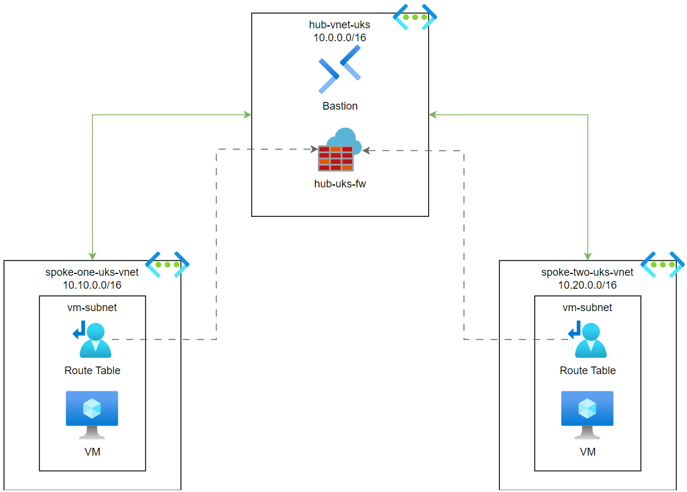

# Networking: Simple Hub & Spoke

This Terraform configuration builds a simple hub and spoke architecture, using Azure Firewall as a Network Virtual Appliance (NVA) to route between spokes.

## Spoke to spoke traffic

After deploying this Terraform configuration, you should be able to communicate between `spoke-one-uks-vm` and `spoke-two-uks-vm`, even though they are in different virtual networks. This works because:

- Each spoke is peered to the hub, with network forwarding enabled.
- A user defined route table to associated to each virtual machine subnet, forcing traffic that isn't destined for the local virtual network through the firewall.
- Azure Firewall acts as a Network Virtual Appliance (router), routing traffic between spokes.
- By default, spoke to spoke traffic is denied by Azure Firewall, so we add a custom network rule allowing all traffic between `spoke-one-uks-vnet` and `spoke-two-uks-vnet`.

To test this yourself, login to either VM via Bastion, and ping the private ip address of the other virtual machine.

## Azure Firewall

In this architecture, Azure Firewall provides:
- Routing between spokes.
- Network traffic filtering (deny all traffic by default).
- A single outbound IP address for all egress traffic.