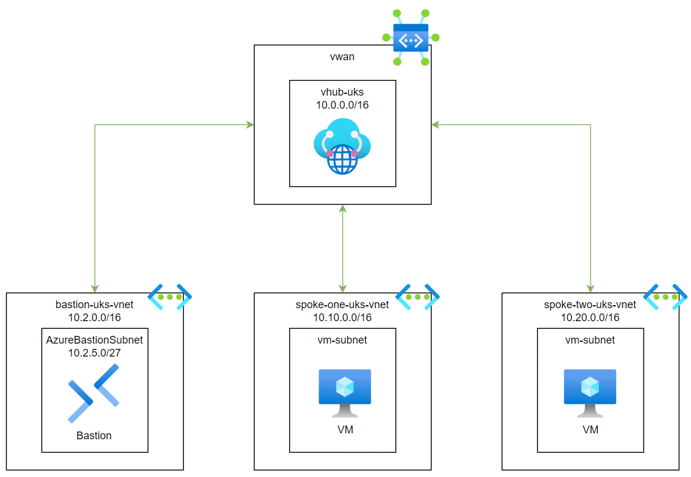

# Networking: Virtual WAN Hub & Spoke

This Terraform configuration builds a hub and spoke architecture using Azure VWAN, the VWan Hub takes care of routing, meaning we don't need an Azure Firewall or user defined route tables.

## Spoke to spoke traffic

After deploying this Terraform configuration, you should be able to communicate between `spoke-one-uks-vm` and `spoke-two-uks-vm`, even though they are in different virtual networks. This works because each spoke is connected to the hub, which provides transitive routing capabilities without the need for an additional network virtual appliance (NVA).

To test this yourself, login to either VM via Bastion, and ping the private ip address of the other virtual machine.

### Links
- [Global transit network architecture and Virtual WAN](https://learn.microsoft.com/en-us/azure/virtual-wan/virtual-wan-global-transit-network-architecture)